# Sample-product lifecycle — human steps + skill/MCP

The full lifecycle of one sample-product, from barcode-photo intake to resale
analytics. Each 🧑 human step is paired with the 🤖 skill/MCP action it
triggers. Everything threads on one join key: `product_id` = the sample's
`qr_code`, stamped alongside `sample_id` + `creator` on every Graylog event.

**Status:** 🤖✅ built today · ⬜ stub / proposed · ⚠ gap (needs work).

```mermaid
flowchart TD
    classDef human fill:#e3f2fd,stroke:#1565c0,color:#0d2a4a;
    classDef skill fill:#e8f5e9,stroke:#2e7d32,color:#11331a;
    classDef decision fill:#fff8e1,stroke:#f9a825,color:#3a2e00;
    classDef data fill:#ede7f6,stroke:#5e35b1,color:#21103f;
    classDef stub fill:#fff3e0,stroke:#ef6c00,color:#3a1f00,stroke-dasharray:5 4;
    classDef gap fill:#ffebee,stroke:#c62828,color:#3a0000,stroke-dasharray:5 4;

    subgraph INTAKE["1 · INTAKE — barcode/photo → catalog"]
        H1["🧑 'Add this sample — here's a barcode photo'"]:::human
        S1["🤖 /api/upc-lookup or /api/image-lookup<br/>SerpApi Lens/Shopping → ScrapeCreators match"]:::skill
        D1{"Match correct?"}:::decision
        H2["🧑 'No — find candidates for Cupid Desire Drops'"]:::human
        S2["🤖 returns 5 candidate TikTok products to choose"]:::skill
        D2{"Selects 1–5"}:::decision
        S3["🤖 add to catalog: /api/sample-products upsert<br/>+ tracker sample row · productId = qr_code"]:::skill
        D3{"productId unique?"}:::decision
        S4["🤖 NEW unique sample-product lifecycle starts<br/>sample_id + qr_code (creator set via assign_sample ✅)"]:::skill
        EX["🤖 attach as another physical unit<br/>of an existing product"]:::skill
    end

    H1 --> S1 --> D1
    D1 -- yes --> S3
    D1 -- no --> H2 --> S2 --> D2 --> S3
    S3 --> D3
    D3 -- unique --> S4
    D3 -- exists --> EX

    subgraph CONTENT["2 · CONTENT — multi-key attribution"]
        H3["🧑 makes videos + LIVEs for the product"]:::human
        S5["🤖 extension scrapers → Graylog<br/>product-analysis / streamer / live<br/>(creator + Product ID)"]:::skill
        H4["🧑 scrapes their order list (extension)"]:::human
        S6["🤖 order-received → Graylog<br/>⚠ no productId/creator yet — GAP"]:::gap
    end

    S4 --> H3 --> S5
    S4 --> H4 --> S6

    ATTR(["🧷 ONE sample-product lifecycle<br/>joined on productId = qr_code<br/>+ sample_id + creator"]):::data
    S4 --> ATTR
    S5 --> ATTR
    S6 -. needs productId .-> ATTR

    subgraph ASSIGN["1b · ASSIGN — agency fulfillment + creator assignment — ✅ built"]
        H8["🧑 'we got 50 Cupids Desire Drops for kyle's agency'"]:::human
        S10["🤖 agency_intake ✅<br/>N units → reserved, credited to bucket (kyle)<br/>sample_intake_json"]:::skill
        H9["🧑 'assign 1 Cupids Desire Drops to @boosteddealsdaily'"]:::human
        S11["🤖 list_product_creators ✅ (derived dropdown:<br/>creators who ordered it — affiliate-export)"]:::skill
        S12["🤖 assign_sample ✅ → checked_out + creator<br/>+ campaign match + enrichment note<br/>(bundle REAL · daily-goal/promo CONFIG)"]:::skill
    end

    S4 --> H8 --> S10 --> H9
    H9 --> S11 --> S12
    S12 --> ATTR
    S12 -. assigned creator makes content .-> H3

    subgraph LIST["3 · LIST ON MARKETPLACE — ✅ built"]
        H5["🧑 'List this on eBay / OfferUp / FB Marketplace for $45'"]:::human
        S7["🤖 list_on_marketplace ✅<br/>Graylog sample_listing_json<br/>creator + product_id + ask_price_num"]:::skill
    end

    ATTR --> H5 --> S7

    subgraph SOLD["4 · SOLD — ✅ built"]
        H6["🧑 'Mark it sold on eBay for $40 → @wizardofdealz'"]:::human
        S8["🤖 mark_sample_sold ✅<br/>Postgres status=sold · Graylog sample_sold_json<br/>creator + gmv_num + net_num"]:::skill
        H7["🧑 'Sold a bulk lot of 12 samples for $300'"]:::human
        S9["🤖 bulk_sample_sold ✅<br/>allocate the lot across sample_ids/creators<br/>→ per-sample sample_sold_json + bulk_id"]:::skill
    end

    S7 --> H6 --> S8
    S7 --> H7 --> S9
    S8 --> ATTR
    S9 --> ATTR

    subgraph ASK["5 · ANALYTICS — graylog-query reads it back"]
        Q1["🧑 'How much GMV did my content drive?'<br/>(answerable after CONTENT)"]:::human
        A1["🤖 graylog-query: affiliate gmv_num by creator"]:::skill
        Q2["🧑 'What's listed, and what net profit did it sell for?'<br/>(answerable after LIST/SOLD)"]:::human
        A2["🤖 graylog-query: ask_price_num (listing) vs<br/>net_num (sold), by creator"]:::skill
        Q3["🧑 'Where do we make the most $ per sample product?'"]:::human
        A3["🤖 graylog-query: net_num by marketplace / product_id"]:::skill
        Q4["🧑 'Same questions for bulk sales?'"]:::human
        A4["🤖 graylog-query: bulk lots are normal<br/>sample_sold_json (bulk_id) — same recipes"]:::skill
    end

    ATTR --> ASK
    Q1 --> A1
    Q2 --> A2
    Q3 --> A3
    Q4 --> A4

    subgraph LEGEND["legend"]
        L1["🤖 ✅ built today"]:::skill
        L2["⬜ stub / proposed"]:::stub
        L3["⚠ gap — needs work"]:::gap
        L4["🧷 join hub"]:::data
        L5["🧑 human step"]:::human
    end
```

## What's built vs. remaining

- **✅ Built:** intake lookup (`/api/upc-lookup`, `/api/image-lookup`,
  `/api/sample-products`), `update_sample_status`, `list_product_creators`
  (derived assigned-creator dropdown), `agency_intake` (bulk lot → reserved
  bucket), `assign_sample` (fulfillment → `checked_out` + campaign match +
  bundle/goal/promo enrichment note), `list_on_marketplace`, `mark_sample_sold`,
  `bulk_sample_sold`, and `graylog-query` read-back. Creator attribution is set
  via `assign_sample` (`checked_out_to`), so no `creator_id`-at-intake column is
  needed.
- **🟡 Config, not measured:** campaign membership + daily-video goal + promo
  come from `core/campaign-config.json` (no campaign/goal/promo data source
  exists yet — the enrichment note labels them `[from campaign-config]`). Bundle
  membership in the note IS real (`samples.bundle_id`).
- **⚠ Gap:** the order-received / order-list scrape carries no
  `productId`/`creator`, so it can't itself feed the derived dropdown —
  creators-for-product are derived from `tiktok-affiliate-export` instead.
  Closing the order-scrape gap needs a tok-scrape change to stamp
  `_creator`/`_product_id` — out of scope here.

See [lifecycle-events.md](lifecycle-events.md) for the exact event field schemas
and the `graylog-query` read-back recipes.
